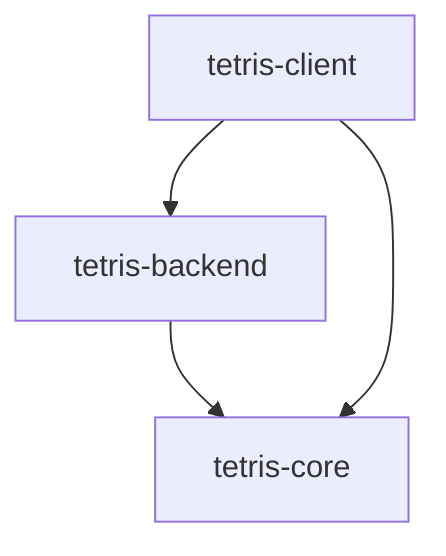

# 📚 개발자 가이드

## 📋 목차
- [개발 환경 설정](#개발-환경-설정)
- [Version Catalog 의존성 관리](#version-catalog-의존성-관리)
- [아키텍처 상세](#아키텍처-상세)
- [브랜치 전략](#브랜치-전략)
- [빠른 참조](#빠른-참조)

---

## 🛠 개발 환경 설정

### Java 21 설치

#### macOS
```bash
# Homebrew 사용
brew install openjdk@21

# Amazon Corretto (권장)
brew install --cask corretto21

# 환경 변수 설정 (.zshrc 또는 .bash_profile)
export JAVA_HOME=/Users/$(whoami)/Library/Java/JavaVirtualMachines/corretto-21.0.8/Contents/Home
export PATH=$JAVA_HOME/bin:$PATH
```

#### Windows
1. [Amazon Corretto 21](https://corretto.aws/downloads/latest/amazon-corretto-21-x64-windows-jdk.msi) 다운로드
2. 설치 후 시스템 환경 변수에 JAVA_HOME 설정

#### Ubuntu/Linux
```bash
# OpenJDK 21 설치
sudo apt update
sudo apt install openjdk-21-jdk

# Amazon Corretto 21 설치 (권장)
wget -O- https://apt.corretto.aws/corretto.key | sudo apt-key add -
sudo add-apt-repository 'deb https://apt.corretto.aws stable main'
sudo apt-get update
sudo apt-get install java-21-amazon-corretto-jdk
```

### IDE 설정

#### VS Code (권장)
```json
// .vscode/settings.json (자동 설정됨)
{
  "java.jdt.ls.java.home": "/path/to/java21",
  "java.import.gradle.enabled": true,
  "java.compile.nullAnalysis.mode": "disabled"
}
```

필수 확장 프로그램:
- Java Extension Pack
- Lombok Annotations Support
- Spring Boot Tools
- Gradle for Java

#### IntelliJ IDEA
1. **File → Project Structure → Project SDK**: Java 21 설정
2. **Settings → Plugins**: Lombok 플러그인 활성화
3. **Settings → Annotation Processors**: Enable annotation processing 체크

---

## 📦 Version Catalog 의존성 관리

이 프로젝트는 **Gradle Version Catalog**를 사용하여 Type-Safe한 의존성 관리를 수행합니다. 기존의 `build.gradle.kts`에 직접 의존성을 추가하는 방식이 아닌 중앙화된 카탈로그 시스템을 사용합니다.

### 📁 Version Catalog 구조

```
gradle/
└── libs.versions.toml    # 모든 의존성을 관리하는 중앙 파일
```

### 🔧 의존성 추가 방법

#### 1단계: libs.versions.toml에 라이브러리 정의

```toml
# gradle/libs.versions.toml

[versions]
# 버전 정의
jackson = "2.17.0"
redis = "3.0.4"

[libraries]
# 공통 라이브러리 (모든 모듈에서 사용 가능)
common-jackson = { module = "com.fasterxml.jackson.core:jackson-core", version.ref = "jackson" }
common-jackson-databind = { module = "com.fasterxml.jackson.core:jackson-databind", version.ref = "jackson" }

# 백엔드 전용 라이브러리
backend-redis = { module = "org.springframework.boot:spring-boot-starter-data-redis", version.ref = "redis" }
backend-jackson = { module = "com.fasterxml.jackson.dataformat:jackson-dataformat-yaml", version.ref = "jackson" }

# 클라이언트 전용 라이브러리
client-jackson = { module = "com.fasterxml.jackson.datatype:jackson-datatype-jsr310", version.ref = "jackson" }
```

#### 2단계: Bundle 정의 (선택적)

```toml
[bundles]
# 관련된 라이브러리들을 묶어서 관리
common-jackson = ["common-jackson", "common-jackson-databind"]
backend-data = ["backend-redis", "backend-jackson"]
```

#### 3단계: build.gradle.kts에서 사용

```kotlin
// tetris-core/build.gradle.kts (현재 프로젝트 실제 구조)
dependencies {
    // 📊 Utility Libraries
    implementation(libs.common.commons.lang3)
    
    // 🛠️ Development Tools (공통 의존성)
    compileOnly(libs.common.lombok)
    annotationProcessor(libs.common.lombok)
    testCompileOnly(libs.common.lombok)
    testAnnotationProcessor(libs.common.lombok)
    
    // 🧪 Testing Dependencies (공통 번들)
    testImplementation(libs.bundles.common.testing)
}

// tetris-backend/build.gradle.kts
dependencies {
    // 모듈 간 의존성
    implementation(project(":tetris-core"))
    
    // 🌱 Backend Spring Boot Dependencies
    implementation(libs.bundles.backend.spring.web)
    implementation(libs.bundles.backend.data)
    implementation(libs.bundles.backend.development)
    
    // 🛠️ Development Tools
    compileOnly(libs.common.lombok)
    annotationProcessor(libs.common.lombok)
}

// tetris-client/build.gradle.kts  
dependencies {
    // 모듈 간 의존성
    implementation(project(":tetris-backend"))
    implementation(project(":tetris-core"))
    
    // 🌱 Client Spring Boot Dependencies (DI 컨테이너)
    implementation(libs.bundles.client.spring)
    
    // 🎨 Client JavaFX Dependencies
    implementation(libs.bundles.client.javafx)
    
    // 🛠️ Development Tools
    compileOnly(libs.common.lombok)
    annotationProcessor(libs.common.lombok)
}
```

### 📝 실제 사용 예시

#### JSON 처리 라이브러리 추가

**1단계**: `gradle/libs.versions.toml` 수정
```toml
[versions]
jackson = "2.17.0"

[libraries]
# 기존 common 라이브러리에 추가
common-jackson-core = { module = "com.fasterxml.jackson.core:jackson-core", version.ref = "jackson" }
common-jackson-databind = { module = "com.fasterxml.jackson.core:jackson-databind", version.ref = "jackson" }
common-jackson-annotations = { module = "com.fasterxml.jackson.core:jackson-annotations", version.ref = "jackson" }

[bundles]
# 기존 common-testing 번들 옆에 추가
common-jackson = [
    "common-jackson-core",
    "common-jackson-databind", 
    "common-jackson-annotations"
]
```

**2단계**: 모듈별 build.gradle.kts에서 사용
```kotlin
// tetris-core/build.gradle.kts (게임 상태 직렬화용)
dependencies {
    // 기존 의존성
    implementation(libs.common.commons.lang3)
    compileOnly(libs.common.lombok)
    
    // 새로 추가된 Jackson
    implementation(libs.bundles.common.jackson)
    
    // 기존 테스트 의존성
    testImplementation(libs.bundles.common.testing)
}
```

#### Redis 캐싱 라이브러리 추가

**1단계**: `gradle/libs.versions.toml`의 backend 섹션에 추가
```toml
[libraries]
# 기존 Backend Spring Boot Dependencies 섹션에 추가
backend-spring-boot-starter-data-redis = { module = "org.springframework.boot:spring-boot-starter-data-redis", version.ref = "spring-boot" }
backend-jedis = { module = "redis.clients:jedis", version = "5.1.0" }

[bundles]
# 기존 backend-data 번들 수정
backend-data = [
    "backend-spring-boot-starter-data-jpa",
    "backend-h2-database",
    "backend-spring-boot-starter-data-redis",  # 추가
    "backend-jedis"  # 추가
]
```

**2단계**: tetris-backend/build.gradle.kts에서 사용
```kotlin
// tetris-backend/build.gradle.kts
dependencies {
    // Core 모듈 의존성
    implementation(project(":tetris-core"))
    
    // 기존 Spring Boot 의존성
    implementation(libs.bundles.backend.spring.web)
    implementation(libs.bundles.backend.data)  # Redis가 이미 포함됨
    
    // 기존 개발 도구
    compileOnly(libs.common.lombok)
    annotationProcessor(libs.common.lombok)
}
```

#### JavaFX 추가 컨트롤 라이브러리 추가

**1단계**: `gradle/libs.versions.toml`의 client 섹션에 추가
```toml
[versions]
# 기존 버전에 추가
controlsfx = "11.2.1"

[libraries]
# 기존 Client JavaFX Dependencies 섹션에 추가  
client-controlsfx = { module = "org.controlsfx:controlsfx", version.ref = "controlsfx" }

[bundles]
# 기존 client-javafx 번들 확장
client-javafx-extended = [
    "client-javafx-controls",
    "client-javafx-fxml",
    "client-controlsfx"  # 추가
]
```

**2단계**: tetris-client/build.gradle.kts에서 사용
```kotlin
// tetris-client/build.gradle.kts
dependencies {
    // 기존 모듈 의존성
    implementation(project(":tetris-backend"))
    implementation(project(":tetris-core"))
    
    // 기존 Spring Boot 의존성 (DI용)
    implementation(libs.bundles.client.spring)
    
    // 확장된 JavaFX 의존성
    implementation(libs.bundles.client.javafx.extended)  # ControlsFX 포함
    
    // 기존 개발 도구
    compileOnly(libs.common.lombok)
    annotationProcessor(libs.common.lombok)
}
```

### 🎯 네이밍 규칙

#### 라이브러리 이름 규칙
```toml
[libraries]
# 형식: <모듈>-<라이브러리명>
common-lombok = { ... }        # 모든 모듈에서 사용
backend-spring-web = { ... }   # 백엔드에서만 사용  
client-javafx-controls = { ... } # 클라이언트에서만 사용
```

#### Bundle 이름 규칙
```toml
[bundles]
# 형식: <모듈>-<기능그룹>
common-testing = [...]      # 공통 테스트 의존성
backend-data = [...]        # 백엔드 데이터 관련
client-ui = [...]          # 클라이언트 UI 관련
```

### ⚡ 의존성 추가 워크플로

1. **라이브러리 검색**: [Maven Repository](https://mvnrepository.com/)에서 원하는 라이브러리 찾기
2. **Version Catalog 수정**: `gradle/libs.versions.toml`에 버전과 라이브러리 정의
3. **Build Script 수정**: 해당 모듈의 `build.gradle.kts`에 의존성 추가  
4. **IDE 새로고침**: VS Code에서 `Java: Reload Projects` 실행
5. **빌드 테스트**: `./gradlew build`로 의존성 충돌 확인

### 🔍 의존성 확인 명령어

```bash
# 전체 프로젝트 의존성 확인
./gradlew dependencies

# 특정 모듈의 의존성 확인  
./gradlew :tetris-core:dependencies
./gradlew :tetris-backend:dependencies
./gradlew :tetris-client:dependencies

# 의존성 트리 시각화
./gradlew :tetris-backend:dependencies --configuration runtimeClasspath

# 버전 충돌 확인
./gradlew dependencyInsight --dependency jackson-core
```

### 💡 Best Practices

#### 1. 버전 통일
```toml
# ✅ 좋은 예: 관련 라이브러리들의 버전 통일
[versions]
jackson = "2.17.0"

[libraries]
common-jackson-core = { module = "com.fasterxml.jackson.core:jackson-core", version.ref = "jackson" }
common-jackson-databind = { module = "com.fasterxml.jackson.core:jackson-databind", version.ref = "jackson" }

# ❌ 나쁜 예: 각각 다른 버전 사용
common-jackson-core = { module = "com.fasterxml.jackson.core:jackson-core", version = "2.17.0" }
common-jackson-databind = { module = "com.fasterxml.jackson.core:jackson-databind", version = "2.16.1" }
```

#### 2. 모듈별 분리
```toml
# ✅ 모듈별로 명확하게 분리
[libraries]
common-lombok = { ... }           # 모든 모듈
backend-spring-web = { ... }      # 백엔드만
client-javafx-controls = { ... }  # 클라이언트만

# ❌ 모듈 구분 없이 혼재
spring-web = { ... }       # 어느 모듈용인지 불명확
lombok = { ... }           # 어느 모듈용인지 불명확
```

#### 3. Bundle 활용
```toml
# ✅ 관련된 라이브러리들을 Bundle로 그룹화
[bundles]
common-testing = [
    "common-junit-jupiter",
    "common-assertj-core",
    "common-mockito-core"
]

# build.gradle.kts에서 간단하게 사용
dependencies {
    testImplementation(libs.bundles.common.testing)
}
```

---

## 🏗 아키텍처 상세

### 모듈 간 의존성



### 계층별 책임

#### 🎯 Core Layer (tetris-core)
```java
// 순수 Java 도메인 객체
@Data
@Builder
public class Block {
    private BlockType type;
    private Position position;
    private Color color;
}

// 비즈니스 로직
public class TetrisEngine {
    public boolean canPlaceBlock(Board board, Block block) {
        // 순수한 게임 로직
    }
}
```

#### ⚙️ Service Layer (tetris-backend)
```java
// Spring Boot 서비스
@Service
@Slf4j
public class GameService {
    
    @Autowired
    private GameRepository repository;
    
    public GameState createNewGame() {
        // 비즈니스 로직 + 데이터 영속성
    }
}

// REST API
@RestController
@RequestMapping("/api")
public class GameController {
    
    @Autowired
    private GameService gameService;
    
    @GetMapping("/status")
    public ResponseEntity<GameStatus> getStatus() {
        // HTTP API 제공
    }
}
```

#### 🖥️ Presentation Layer (tetris-client)
```java
// JavaFX + Spring 통합
@SpringBootApplication
public class TetrisApplication extends Application {
    
    private ConfigurableApplicationContext context;
    
    @Override
    public void init() throws Exception {
        // Spring Context 초기화
        context = SpringApplication.run(TetrisApplication.class);
    }
}

// JavaFX 컨트롤러에서 Spring 서비스 사용
@Component
public class GameController {
    
    @Autowired
    private GameService gameService;  // Backend 서비스 주입
    
    @FXML
    private void startNewGame() {
        GameState game = gameService.createNewGame();
        // UI 업데이트
    }
}
```

### Version Catalog 구조

```toml
# gradle/libs.versions.toml
[versions]
java = "21"
spring-boot = "3.5.6"
javafx = "21"
lombok = "1.18.30"

[libraries]
# 공통 의존성
common-lombok = { module = "org.projectlombok:lombok", version.ref = "lombok" }

# 백엔드 의존성
backend-spring-boot-starter = { module = "org.springframework.boot:spring-boot-starter", version.ref = "spring-boot" }

# 클라이언트 의존성  
client-javafx-controls = { module = "org.openjfx:javafx-controls", version.ref = "javafx" }

[bundles]
common-testing = ["common-junit-jupiter", "common-assertj-core"]
backend-spring-web = ["backend-spring-boot-starter-web"]
client-javafx = ["client-javafx-controls", "client-javafx-fxml"]
```

---

## 🌿 브랜치 전략

### Git Flow 기반 전략

```
main                     # 프로덕션 릴리즈
├── develop             # 개발 통합 브랜치
├── feature/이슈번호/기능명  # 기능 개발
├── bugfix/이슈번호/설명   # 버그 수정
└── hotfix/이슈번호/설명   # 긴급 수정
```

### 브랜치 네이밍 규칙

#### 기능 개발
```bash
feature/24/game-engine     # 이슈 #24: 게임 엔진 개발
feature/31/score-system    # 이슈 #31: 점수 시스템
feature/45/ui-design      # 이슈 #45: UI 디자인
```

#### 버그 수정
```bash
bugfix/52/block-rotation   # 이슈 #52: 블록 회전 버그
bugfix/61/memory-leak     # 이슈 #61: 메모리 누수
```

#### 모듈별 구분
```bash
feature/core/block-logic      # Core 모듈 작업
feature/backend/rest-api      # Backend 모듈 작업
feature/client/javafx-ui      # Client 모듈 작업
```

### 커밋 메시지 규칙

```bash
# 형식
<type>(<scope>): <subject>

# 예시
feat(core): 블록 회전 로직 구현
fix(backend): REST API 응답 오류 수정
docs(readme): 개발 가이드 업데이트
style(client): JavaFX CSS 스타일 정리
refactor(core): 게임 엔진 코드 리팩토링
test(backend): 서비스 계층 단위 테스트 추가
chore(build): Gradle 설정 업데이트
```

### Pull Request 템플릿

```markdown
## 🎯 작업 내용
- [ ] 기능 A 구현
- [ ] 기능 B 수정
- [ ] 테스트 코드 작성

## 🧪 테스트
- [ ] 단위 테스트 통과
- [ ] 통합 테스트 확인
- [ ] 수동 테스트 완료

## 📷 스크린샷 (UI 변경 시)
<!-- 스크린샷 첨부 -->

## 📝 추가 정보
<!-- 추가 설명이나 주의사항 -->
```

---

## ⚡ 빠른 참조

### 자주 사용하는 Gradle 명령어

```bash
# 전체 빌드
./gradlew build

# 특정 모듈 빌드
./gradlew :tetris-core:build
./gradlew :tetris-backend:build
./gradlew :tetris-client:build

# 테스트 실행
./gradlew test                    # 전체 테스트
./gradlew :tetris-core:test      # Core 모듈 테스트

# 애플리케이션 실행
./gradlew :tetris-backend:bootRun  # 백엔드 서버
./gradlew :tetris-client:run       # 클라이언트

# JAR 생성
./gradlew :tetris-backend:bootJar  # 실행 가능한 JAR
./gradlew assemble                 # 모든 JAR

# 의존성 확인
./gradlew dependencies             # 전체 의존성
./gradlew :tetris-core:dependencies  # 특정 모듈
```

### 통합 개발 스크립트

```bash
# 프로젝트 루트의 tetris.sh 사용
./tetris.sh build     # 프로젝트 빌드
./tetris.sh client    # 클라이언트 실행  
./tetris.sh backend   # 백엔드 서버 실행
./tetris.sh test      # 전체 테스트
./tetris.sh check     # 환경 체크
```

### 문제 해결

#### Gradle 빌드 실패
```bash
./gradlew --stop      # 데몬 종료
./gradlew clean       # 빌드 캐시 삭제
./gradlew build       # 다시 빌드
```

#### Lombok 인식 안됨 (VS Code)
1. `Cmd+Shift+P` → `Java: Reload Projects`
2. `Cmd+Shift+P` → `Developer: Reload Window`

#### 포트 충돌 (8080)
```yml
# tetris-backend/src/main/resources/application.yml
server:
  port: 8081
```

#### JavaFX 모듈 오류
```bash
# JVM 인수 확인 (자동 설정됨)
--module-path /path/to/javafx/lib --add-modules javafx.controls,javafx.fxml
```
